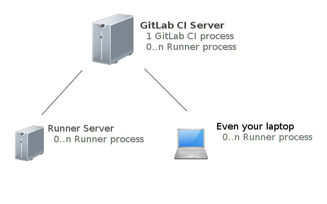

[link: gitbook](http://linnovate.gitbooks.io/handbook/content/) [link: github](https://github.com/linnovate/handbook/)

# Introduction

**motivation**
- Q: how to maintain our code ?
- A: we want to test it and set a status of ok OR error for each commit.

**glossary:**

- what is 'a build' ?
- the process of cloning the repository code for commit:X
- running a test on the code
- report the commiter if test has failed
- this process done by the machine which called the 'gitlab-ci-runner' and registered on 'gitlab-ci'
- the developer can choose a gitlab-ci-runner from the web interface of the gitlab-ci server
