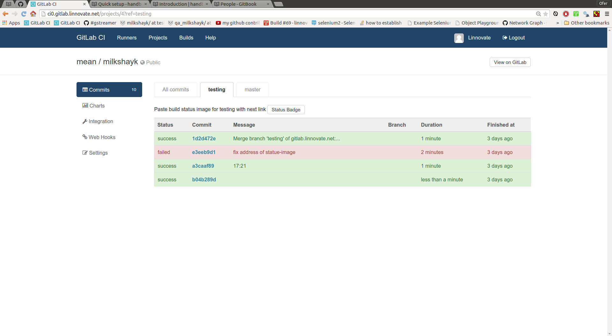

# commits with green/red status (aks: builds)
- the tab items are named branches(like: Master, testing, github_pages )
- to set which branch triggers a build - configure the page on the repo -> integration-> gitlab.ci -> settings

