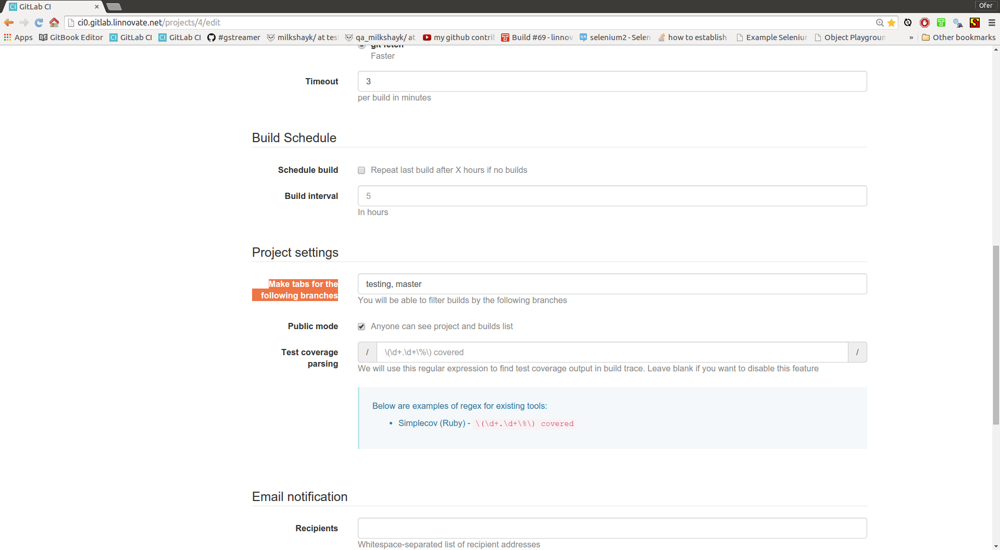

menu -> settings
----
- settings ( **notice:** scroll down to view more options ! )

configuration options
----
- branches: which ones triggers a build (comma-separeted values)
- timeout:  setting a timeout for a build (set a time-frame for a normal test)

