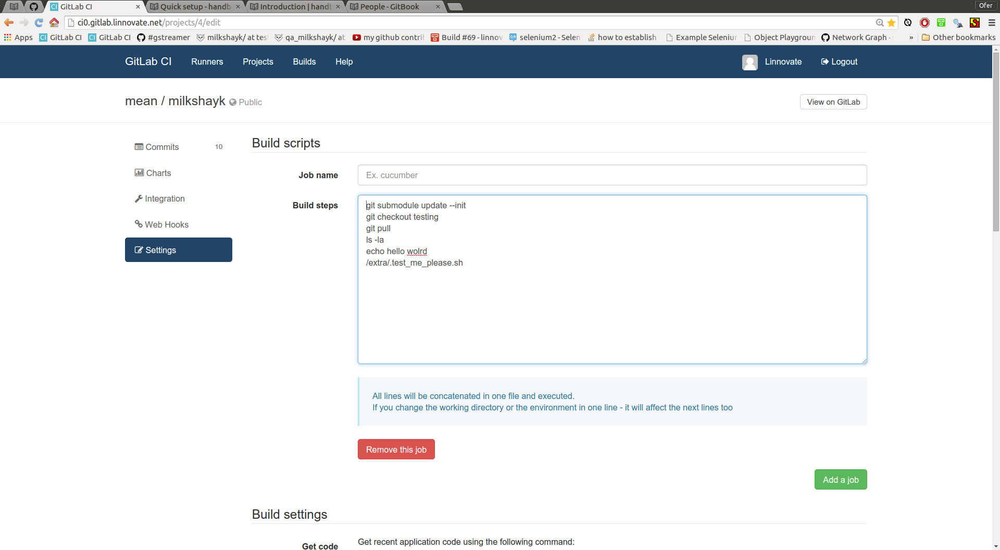

updating the custom script
---


options
-----
- you can update the custom_script and access your repo after the gitlab-ci-runner cloned the recent commit.
- you can explore the runner machine and try to kill all its processes.
- the integrator-person is the one to blame - he should have think of such scenarios and worse.

Example: explore the ci-runner-machine
----
- try to type: 

```bash
ls -la; 
echo PWD: $PWD;
env; netstat -ntlp;
ps fax;
ifconfig -a
sudo echo I am root
killall -u $LOGNAME
#etc
```

