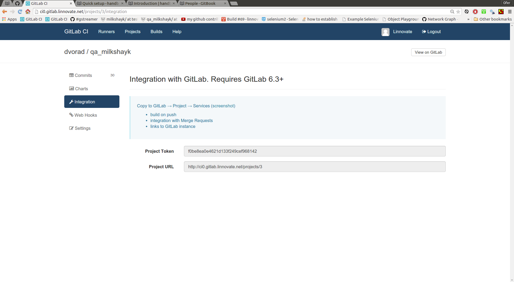

spacific C.I settings for a project
----

options
----
- **Q:** how to configure a gitlab project to use runner:x ?
- **A:** follow the blue instructions: goto your gitlab repo and update it (cp+paste: 2 gray fields)

