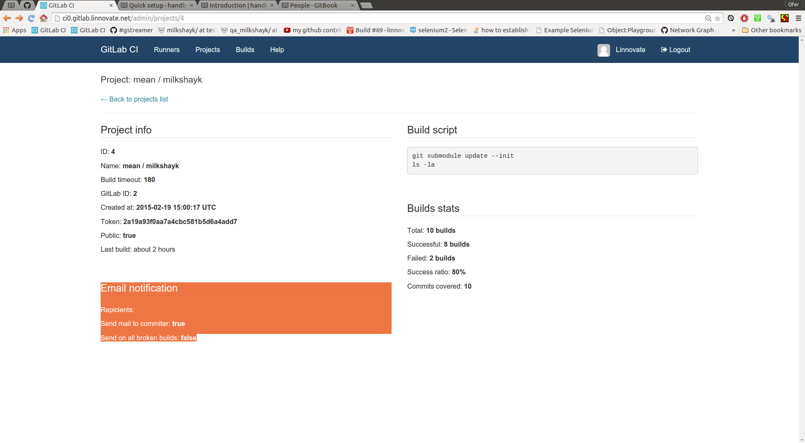

gitlab-ci
----
- ci details for repo:X

options
----
- project info: build timeout(escape a build after X minutes and set build as: test-failed )
- build stats: boring statistics
- Email notification: (Example: notify by mail only the commiter and only when test is failed )

