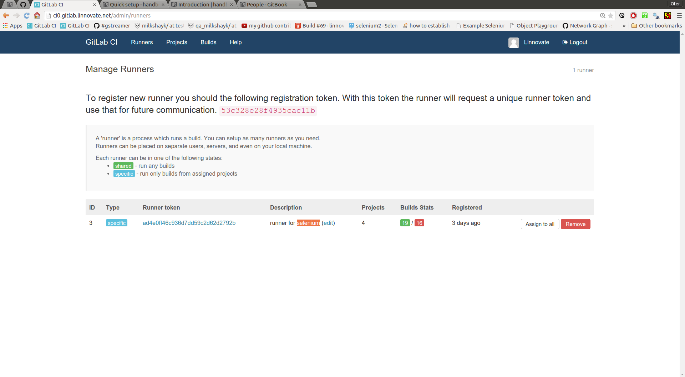

gitlab-ci
----
- list of gitlab-ci-runner machines which registered themself on the gitlab-ci server

options:
----
- pick a runner with description:'X' and assign it to your project of type:'X'
- example: pick a runner which described as: 'runner for a mean project' if you want to test your repository using command: 'grunt test'
- if you want a runner-machine which is not listed - build one or ask the integrator-person to do it.

