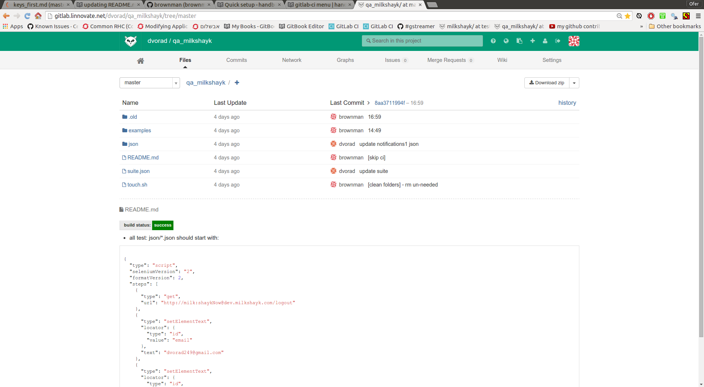

I want to edit the README.md to indicate the recent build-state ?
---

update README.md with the status image
----
- **status image:** color indication for test-pass/test-fail
- **color indication:** if red looks like green for you - open a new [issue](https://github.com/gitlabhq/gitlab-ci/issues) on github !

options
-----
- **Q:** how to update the front-page of my project to show the build status ?
- **A:** press on branch:X1 -> button:"Status Badge" + cp the link suitable for format:Markdown + add file README.md to your repo on branch:X1 and paste the link + rm a file named: README if exist OR README.md will be ignored.

example
----

