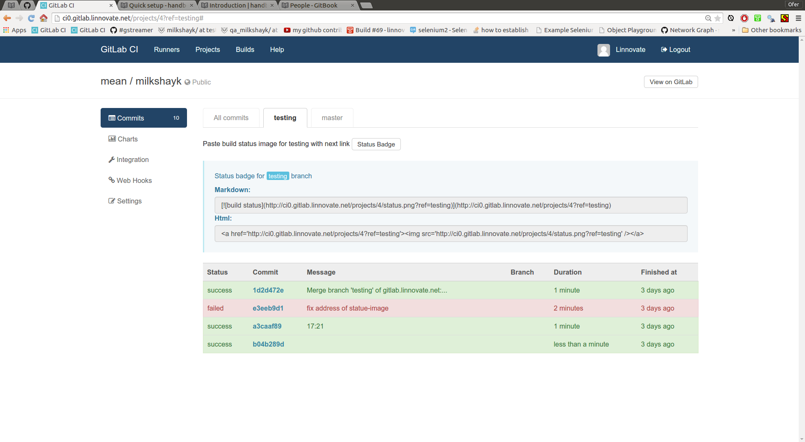

gitlab-ci + gitlab
----

options
-----
- Q: how to update the front-page of my project to show the build status ?
- A: press on button:"Status Badge" + cp the link suitable for format:Markdown + add file README.md to your repo and paste the link + rm a file named: README if exist OR README.md will be ignored.

